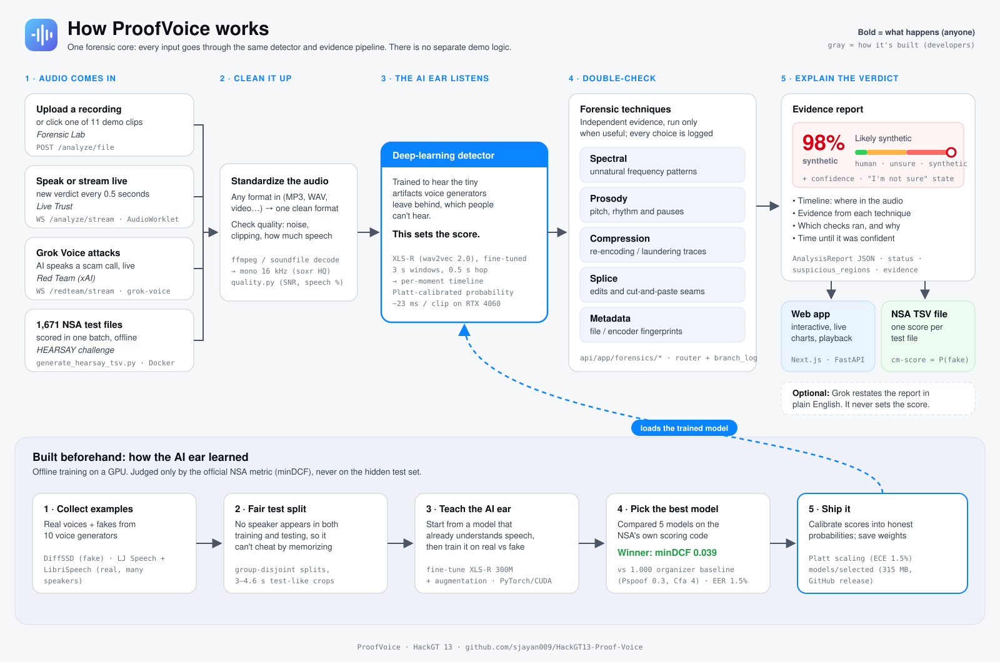

# ProofVoice — a real-time evidence layer for synthetic speech

## 👉 NSA HEARSAY judges: start here

| | |
|---|---|
| 📄 **Final prediction TSV** | **[`00_NSA_HEARSAY_SUBMISSION/ProofVoice_final.tsv`](00_NSA_HEARSAY_SUBMISSION/ProofVoice_final.tsv)** — 1,671 rows, `cm-score` = P(synthetic), 1.0 = synthetic |
| 🔁 Same scores, bona-fide-high | [`ProofVoice_final_bonafide_high.tsv`](00_NSA_HEARSAY_SUBMISSION/ProofVoice_final_bonafide_high.tsv) — `1 − p`, if your scorer expects higher = real |
| 📊 **Validation minDCF (NSA settings: Pspoof 0.3, Cfa 4)** | **0.039** · EER **1.53%** · AUC 0.999 — [how it's computed](00_NSA_HEARSAY_SUBMISSION/README.md#validation-performance-lower-mindcf-is-better) |
| 🧠 Model weights | [GitHub Release `hearsay-final`](https://github.com/sjayan009/HackGT13-Proof-Voice/releases/tag/hearsay-final) (315 MB, too large for git) |
| 🐳 Reproduce the TSV | [Docker, offline, 3 commands](#hearsay-tsv-offline-no-internet-no-xai) |
| 🔬 Forensic techniques | [7 families, with code links](#forensic-techniques-distinct-families) |
| 🗺️ Architecture (1 picture) | [`docs/architecture.svg`](docs/architecture.svg) |
| 🎬 **Demo video (1:40)** | **[▶ Watch on YouTube](https://youtu.be/hpHuJdQuLgU)** · [MP4 in repo](00_NSA_HEARSAY_SUBMISSION/ProofVoice_demo_video.mp4) |

Everything is also summarized on one page: **[00_NSA_HEARSAY_SUBMISSION/README.md](00_NSA_HEARSAY_SUBMISSION/README.md)**.

---

**▶ [Watch the 1:40 demo video](https://youtu.be/hpHuJdQuLgU)**

> Three seconds of speech can be enough to clone a voice. ProofVoice asks: **how quickly can we know that the voice
> we're hearing is synthetic — and what evidence supports that?**

ProofVoice detects, localizes and explains evidence of synthetic speech in audio files and live streams, while
explicitly representing uncertainty. One forensic core powers:

- **NSA HEARSAY** batch inference → the prediction TSV (`ml/generate_hearsay_tsv.py`, Docker)
- **Forensic Lab** (upload any audio → probability, trust timeline, suspicious regions, evidence cards, branch log)
- **Live Trust** (microphone → rolling probability, time-to-confidence, uncertainty)
- **Grok Red Team** (Grok Voice speaks → the *same* audio bytes stream through the *same* detector, live)

**Headline (validation, organizer minDCF code, lower is better):** fine-tuned XLS-R detector
**minDCF 0.039 at NSA's final scoring settings (Pspoof 0.3, Cfa 4) · EER 1.5 % · AUC 0.999**. Under the
HackGTMinDCF.zip default (Pspoof 0.5) the same model scores 0.066, vs 1.000 for the organizer's AASIST checkpoint
zero-shot and 0.506 for hand-crafted forensic features alone. **6/6** live Grok Voice clips (a generator never seen in training) flagged.
23 ms per 4 s clip on a laptop RTX 4060.

All measured numbers live in **[RESULTS.md](RESULTS.md)** (auto-generated from result files; nothing typed by hand)
and in the app's Evaluation drawer. The subgroup and domain-shift audit is in **[MODEL_STRATEGY.md](MODEL_STRATEGY.md)**.
Engineering log: **[PROGRESS.md](PROGRESS.md)**.

---

## Quick start

### HEARSAY TSV (offline, no internet, no xAI)

```bash
# model weights (not in git): unzip into the repo root -> models/selected/
curl -L -o proofvoice_model.zip https://github.com/sjayan009/HackGT13-Proof-Voice/releases/download/hearsay-final/proofvoice_model_selected_v3.zip
unzip proofvoice_model.zip          # Windows PowerShell: Expand-Archive proofvoice_model.zip -DestinationPath .
docker build -t proofvoice .
docker run --rm -v "$PWD/data/hearsay:/data" -v "$PWD/outputs:/out" proofvoice
# -> outputs/team_predictions.tsv  (cm-score = synthetic probability, 1.0 = synthetic)
# -> outputs/team_predictions_bonafide_high.tsv  (1 - p; see "Score orientation" below)
```

`/data` must contain `test/` (the organizer `HackGTHearsayTesting.zip` or its extracted WAVs) and
`template/HearsayScoreKey4TeamX.tsv`. Without Docker:

```bash
python -m venv .venv && .venv/Scripts/pip install torch==2.6.0 --index-url https://download.pytorch.org/whl/cu124
.venv/Scripts/pip install -r requirements.txt
.venv/Scripts/python ml/generate_hearsay_tsv.py --input data/hearsay/test \
    --template data/hearsay/template/HearsayScoreKey4TeamX.tsv --output outputs/team_predictions.tsv
.venv/Scripts/python ml/validate_hearsay_tsv.py --pred outputs/team_predictions.tsv \
    --template data/hearsay/template/HearsayScoreKey4TeamX.tsv
```

### App (API + web) — run locally

The app is two processes: the **FastAPI detector** on `:8000` and the **Next.js web UI** on `:3000`.
Run each in its own terminal from the repo root.

Commands below use Git Bash / macOS / Linux syntax (`.venv/Scripts/python`). In Windows **Command Prompt** use
backslashes (`.venv\Scripts\python ...`); in **PowerShell** prefix with `.\` (`.\.venv\Scripts\python ...`).
On macOS/Linux the venv interpreter is `.venv/bin/python`.

**0. One-time setup**

```bash
python -m venv .venv
.venv/Scripts/pip install torch==2.6.0 --index-url https://download.pytorch.org/whl/cu124   # CPU: .../whl/cpu
.venv/Scripts/pip install -r requirements.txt
cd web && npm install && cd ..
```

Model weights are **not in git** (`models/**/*.pt` is ignored; `model.pt` is ~315 MB). The API loads
`models/selected/` (`model.pt`, `calibration.json`, `meta.json`, `backbone_config/`); copy that folder in, or point
`PROOFVOICE_MODEL_DIR` at it. ffmpeg on `PATH` is needed for MP3/M4A/MP4 input.

Optional `api/.env` (never committed):

```bash
XAI_API_KEY=...        # Grok red team + "Explain this result"; without it the red team replays a cached,
                       # previously generated Grok Voice clip and labels it as such
DEVICE=auto            # auto | cuda | cpu
```

**1. Start the API** (terminal 1)

```bash
.venv/Scripts/python -m uvicorn app.main:app --app-dir api --host 127.0.0.1 --port 8000
curl http://127.0.0.1:8000/health          # -> {"status":"ok", ... "device":"cuda"}
```

Windows Command Prompt:

```bat
.venv\Scripts\python -m uvicorn app.main:app --app-dir api --host 127.0.0.1 --port 8000
```

**2. Start the web UI** (terminal 2)

```bash
cd web && npm run dev                      # http://localhost:3000
```

The UI reads `NEXT_PUBLIC_API_BASE_URL` / `NEXT_PUBLIC_WS_BASE_URL` from `web/.env.local`
(default `http://127.0.0.1:8000`). To point one browser at a different backend without rebuilding, open
`http://localhost:3000/?api=http://HOST:PORT` (remembered per browser, shown as "custom" in the header;
`?api=default` resets it).

Production build instead of dev server:

```bash
cd web && npm run build && npm start       # http://localhost:3000
```

**Demo samples (one click, no files needed).** Forensic Lab ships 11 held-out clips in `web/public/samples/`
(real LibriSpeech/LJ Speech, DiffSSD voice clones, unseen Grok Voice, and one known hard case the detector
misses). Each can be previewed, analyzed with one click, and shows its ground truth after the result. If the API
is down, samples fall back to the reference report the real API produced for that clip, labeled as precomputed.
To rebuild them (needs the API running and `data/` present):

```bash
.venv/Scripts/python web/scripts/build-samples.py
```

**Frontend-only development** (fake data, no model): `cd web && npm run mock` starts a mock backend on `:8000`.

### Tests

```bash
cd api && ../.venv/Scripts/python -m pytest app/tests ../ml/tests -q
```

Covers audio decode (soundfile + ffmpeg), 16 kHz normalization, score range, model reload, batch-padding invariance,
temporal aggregation, pipeline routing/schema, file-upload E2E, WebSocket streaming, Grok fallback, TSV validation,
and **bit-level parity with the organizer minDCF scorer**.

---

## How it works



```text
 file / mic / Grok Voice ──► ingest (soundfile | ffmpeg) ──► mono float32 @ 16 kHz (soxr HQ)
                                   │
            quality scan (always) ─┼─ metadata/container (files)
                                   ▼
                  PRIMARY DETECTOR  (XLS-R SSL front-end, fine-tuned)  ── sets the score
                                   │  sliding windows 2.0 s / 0.5 s hop → trust timeline
       ┌───────────── deterministic, context-driven routing (logged with reasons) ─────────────┐
       │ decision near threshold → spectral + prosody │ lossy / band-limited → compression      │
       │ timeline jumps → splice/discontinuity         │ always → quality (drives confidence)   │
       └────────────────────────────────────────────────────────────────────────────────────────┘
                                   ▼
        status · analysis confidence · suspicious regions · time-to-confidence · evidence cards
```

### Forensic techniques (distinct families)

| Family | Module | Role |
|---|---|---|
| Learned anti-spoofing (SSL wav2vec2/XLS-R + attentive stats pooling) | `api/app/detectors/` | **sets `cm-score`** |
| Container / metadata (codec, encoder tags, sample-rate anomalies) | `api/app/forensics/metadata.py` | evidence |
| Spectral (LFCC/log-mel stats, flatness, rolloff, band-limit, HNR proxy) | `spectral.py` | evidence + routing |
| Prosody (F0 contour, voicing, jitter/shimmer proxies, pauses, monotonicity) | `prosody.py` | evidence |
| Compression / transcoding (cutoff, spectral holes, shelf, double-compression proxy) | `compression.py` | evidence |
| Splice / discontinuity (spectral seams, noise-floor & DC jumps, phase) | `splice.py` | localisation |
| Signal quality (SNR, clipping, speech ratio) | `quality.py` | confidence + routing |

Every report carries `techniques_run`, `why_run`, `evidence` and a `branch_log` (including branches that were
*skipped* and why). Hand-crafted branches were benchmarked standalone and in fusion with the primary detector; they
enter the score only if fusion improves validation minDCF (decision recorded in RESULTS.md).

### Official metric

`ml/evaluate_mindcf.py` wraps the organizer package (`HackGTMinDCF.zip`, ASVspoof 5 Track 1 code). Model selection
used the package's costs **Pspoof = 0.5, Cmiss = 1, Cfa = 4**. NSA later announced that final scoring uses
**Pspoof = 0.3** (the test set's ~30% spoof share) with Cfa = 4. minDCF chooses its own threshold, so the submitted
scores are unaffected and XLS-R v3 remains the best model under both; `ml/rescore_nsa_settings.py` re-scores every
model under both settings with the organizer's own functions
([`outputs/results/mindcf_nsa_settings.json`](outputs/results/mindcf_nsa_settings.json)): v3 **0.039** (0.3) /
0.066 (0.5), v4 0.045 / 0.080, AASIST fine-tuned 0.312 / 0.445.
`ml/tests/test_mindcf_parity.py` checks it against the organizer script and their shipped fixture.

### Score orientation (read this)

The organizer scorer treats a **higher score as more bona fide**; the HEARSAY instructions describe `cm-score` as a
**synthetic probability** (1.0 = synthetic). We submit the latter (`team_predictions.tsv`) and also emit
`team_predictions_bonafide_high.tsv` (= 1 − p). Please confirm with the organizers which orientation is scored.

### Data

- Organizer: DiffSSD (70k clips, 10 generators) + LJRealResampled (242 bona fide clips).
- Added public **LibriSpeech dev-clean + test-clean** (CC BY 4.0) as bona fide: 6 of 10 DiffSSD generators clone
  LibriSpeech speakers, and with only 242 real clips of one speaker a detector learns "not this voice ⇒ fake".
- Not used: the rest of LJSpeech (possible overlap with held-out real clips), and the held-out test set itself
  (no training, no pseudo-labels, no label inspection).
- Splits are group-disjoint (LJ chapter / Libri speaker / sentence id / cloned speaker); validation crops match the
  held-out duration regime (3.0–4.6 s). See `ml/make_splits.py`.

### Honest limitations

- Validation is in-distribution with respect to generator *families*. Leave-one-generator-out retraining has not yet
  been run; six Grok clips are a small smoke test, not an open-world error-rate estimate.
- The two held-out cloned speakers have very different ElevenLabs error rates; see the speaker subgroup table in
  RESULTS.md. The pooled minDCF (0.039 at Pspoof 0.3, 0.066 at 0.5) does not describe every unseen speaker.
- Only 44 LJ bona fide clips exist in validation, so LJ-specific numbers are noisy.
- Scores are probabilities under equal priors (Platt scaling on validation), not proof. Metadata can be forged.
- Speaker similarity is not liveness; no watermark does not mean human.
- **Replay (loudspeaker → room → microphone) is out of domain.** The detector is trained on digital audio (logical
  access). Streamed digitally, 6/6 synthetic demo clips are flagged; played through a simulated phone speaker in a
  room, several synthetic clips drift to human/inconclusive and real speech can flip to synthetic. Live Trust's
  "Stream a clip" mode sends audio digitally for this reason; replay-augmented training is the fix.

## Sponsor tracks

- **NSA HEARSAY** — official-metric-driven model selection, multiple forensic families, context-driven
  orchestration, explainable reports, Docker, validated TSV.
- **Oracle of the Deep** — minDCF-first model race, per-generator + unseen-generator analysis, fusion ablation,
  robustness under laundering (MP3/Opus/AAC/μ-law/noise/gain/clipping), temporal probability + time-to-confidence.
- **Meta — Bringing People Closer Together** — voice cloning attacks the oldest trust signal between people:
  recognising someone by their voice. ProofVoice restores that trust with *interpretable evidence and explicit
  uncertainty* rather than blind confidence. It is not a companion or a social network.
- **SpaceXAI** — Grok Voice (realtime, `grok-voice-latest`) is the red-team adversary: its live synthetic stream is
  fed byte-for-byte into the detector while the judge listens. Grok never sets a score; the optional `/explain`
  endpoint only restates structured evidence.

> "Generation is becoming real-time. Verification has to become real-time too."
